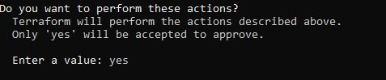
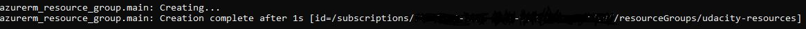

## DevOps Azure Infra structure Operations ##
### Infrastructure as Code Project 1 ###

Deploy a Website with a load balancer using terraform, and packer templates, and the Azure CLI  

#### Requirements ####
Minimum requirements for this project

* Azure CLI (bash) 
* Install Terraform   : https://www.terraform.io/downloads.html
* Install Packer      : https://www.packer.io/downloads

___

#### Deployment Instructions ####

1. Clone repository 

    From Azure command interface 
    > git clone https://github.com/elipski/Udacity_DevOps_Project1

2.  Navigate to Project1\vars.tf

    Implementation specific variables are stored in the vars.tf file. In this file you can set up a default value such as number of VMs to create and the Azure location to create packer and terraform resources. 

    Navigate to Project1\terraform and open vars.tf using your text editor of choice (vi for example). Look for the variable "location" and default setting for location. Currently it is set to eastus2. The location should be the Azure location closed to where the created VMs will be utilized. Edit the file vars.tf and enter the desired default Azure location. The location should be the same location as specified in Step 1 when creating the azure resource group, and the packer image (step 2). Save. 

    

    Terraform Variables: https://www.terraform.io/docs/configuration/variables.html
    
2. Create Resource group (i.e. udacity-resources)

    Navigate to Project1\terrform\create_rg\ nd open vars.tf using your text editor of choice (vi for example). Look for the variable "location" and default setting for location. Currently it is set to eastus2. The location should be the Azure location closed to where the created VMs will be utilized. Edit the file vars.tf and enter the desired default Azure location. The location should be the same location as specified in Step 1 when creating the azure resource group, and the packer image (step 2). Save. 

    Run terraform apply to create the resource group used for packer and terraform resources:

    

    Answer yes when prompted:

    

    **Important**
    Copy the Azure resource group ID after completion and save it for later use. It will look something like the below parameter. Substitute your subscription ID for where you see dashes (-) below:

    >[id=/subscriptions/- - - -/resourceGroups/udacity-resources]

    

3. Edit Packer variables to store Azure secrets unique to your Azure subscription 
    Open azure secrets file in Project1\packer\az_secrets.json

    Packer authenticates with Azure using a service principal. After creating Azure service principle update the az_secrets.json file with your service principles credentials: 
    - client_id 
    - client_secret
    - subscription_id

4. Deploy Packer Image 

    Naviage to Project1\packer.
    
    From the Azure command line Execute the command:

    > packer build -var-file="az_secrets.json" server.json

    This will take a long time.

5. Import resource group into terraform 

    Navigate to Project1\terraform\production and then import the resource group ID you created earlier (in step 1). Use the resource group ID copied earlier.
    
    > terraform import azurerm_resource_group.main /subscriptions/- - - -/resourceGroups/udacity-resources 

    It will aski for the number of VMs to create. Enter any number as this will not affect the actual number of VMs created. 
    
7. Validate the Terrorform deployment

    from Project\terraform\production run:

    > terraform plan -out solution.plan

    Enter the desired number of Linux VMs to create when prompted. 
    Varify there are no errors when complete.

8. Apply Terraform deployment  

    from Project\terraform\production run:

    >terraform apply solution.plan
    
    Varify there are no errors when complete.
